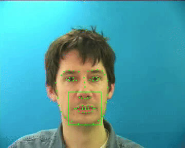

# ssl-kaldi

**Self-Supervised Learning features for [Kaldi](https://github.com/kaldi-asr/kaldi) ASR.**

[](LICENSE)
[](https://www.python.org/)
[](https://github.com/ialmajai/ssl-kaldi/actions/workflows/ci.yml)
[](#contributing)

This repository contains recipes and tools for integrating self-supervised learning (SSL) features — such as HuBERT, mHuBERT, and AV-HuBERT — into Kaldi ASR systems. It bridges modern SSL models with Kaldi's robust pipelines, enabling efficient feature extraction, dimensionality reduction, and end-to-end training for low-resource and standard datasets. The approach uses frozen pretrained models and avoids fine-tuning them.

<p align="center">
  
  <br>
  <em>Lip-region tracking from the <a href="egs/grid/s5/README.md">GRID lipreading recipe</a> (AV-HuBERT visual features).</em>
</p>

## Why ssl-kaldi?

- **Frozen features, no fine-tuning.** Pretrained SSL models act as fixed feature extractors — cheap to run, no GPU-hungry fine-tuning loop.
- **Straight into Kaldi.** Features are written as standard `ark/scp`, so Kaldi's hybrid and chain (TDNN-F) pipelines work unchanged.
- **One toolkit, audio *and* video.** Shared extraction, PCA, and upsampling blocks drive HuBERT, mHuBERT, AfriHuBERT, and AV-HuBERT alike.
- **Low-resource friendly.** Recipes span English, Arabic, Swahili, and visual speech — with strong results on small datasets.

## Pipeline Overview

```
Audio / Video
      ↓
Pretrained SSL model (PyTorch)
      ↓
Frame-level feature extraction
      ↓
PCA dimensionality reduction / Upsampling (optional)
      ↓
Kaldi ark/scp features
      ↓
Standard Kaldi training & decoding
```

The shared building blocks live in [`shared/`](shared/) (SSL extraction, PCA, interpolation, upsampling) and are reused across every recipe in [`egs/`](egs/).

## Recipes

| Recipe | Task | SSL model | Headline result |
|--------|------|-----------|-----------------|
| [mini_librispeech](egs/mini_librispeech/s5/README.md) | English ASR | HuBERT | **4.15% WER** (dev-clean, chain TDNN) |
| [iqraeval](egs/iqraeval/README.md) | Arabic phone recognition | mHuBERT | **11.27% PER** (TDNN-F) |
| [grid](egs/grid/s5/README.md) | Visual speech recognition (lipreading) | AV-HuBERT | **6.36% WER** (unseen speakers) |
| [swahili](egs/swahili/s5/README.md) | Swahili ASR | AfriHuBERT / mHuBERT | **19.76% WER** (E2E TDNN-F) |

## Getting Started

### Prerequisites

A working [Kaldi](https://github.com/kaldi-asr/kaldi) installation is required. Either follow the official Kaldi setup or use the provided Docker images:

```
# CUDA + Kaldi + SSL feature-extraction dependencies
docker build -t ssl-kaldi docker/
docker run --gpus all -it ssl-kaldi
```

The `docker/` directory also ships `Dockerfile.grid`, which adds the extra dependencies (dlib, AV-HuBERT) needed for the GRID lipreading recipe.

### Create a conda environment

```
git clone https://github.com/ialmajai/ssl-kaldi.git
cd ssl-kaldi
conda create -n ssl-kaldi python=3.8 -y
conda activate ssl-kaldi

pip install -r requirements.txt
```

Some recipes have additional requirements; see the per-recipe README (for example, the GRID recipe requires AV-HuBERT and dlib).

## Contributing

Suggestions for improvements or new features are always welcome — feel free to open an issue or submit a pull request.

## Citation

```
@misc{ssl_kaldi,
  author       = {Ibrahim Almajai},
  title        = {ssl-kaldi: SSL features are all you need},
  year         = {2025},
  howpublished = {\url{https://github.com/ialmajai/ssl-kaldi}},
  note         = {Accessed: 2025-11}
}
```

## License

Released under the [Apache 2.0](LICENSE) license.

## Contact

Ibrahim Almajai — ialmajai@gmail.com
