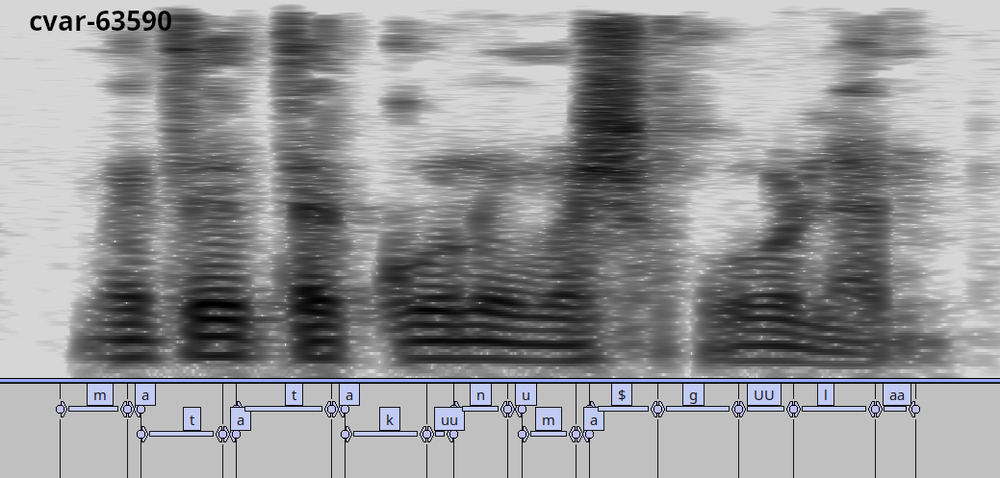

# IqraEval

Arabic phone recognition on the [IqraEval Challenge](https://huggingface.co/IqraEval)
data, using self-supervised speech representations in place of MFCCs. The
pipeline is a standard Kaldi GMM ladder followed by an LF-MMI chain model, with
the feature stage swapped for frozen [mHuBERT-147](https://huggingface.co/utter-project/mHuBERT-147)
embeddings:

| Data directory | Features | Used by |
|----------------|----------|---------|
| `data/<set>_raw` | mHuBERT encoder output, 768-d, 20 ms frame shift | chain TDNN-F |
| `data/<set>_pca` | PCA-reduced SSL features (30-d by default) | mono / tri1 / tri2 |

The SSL model's weights are never updated; `shared/make_ssl.sh` runs it as a
fixed feature extractor and writes ordinary Kaldi `ark/scp` archives.

This is the largest recipe in the repo: 71,376 training utterances and 2.34 M
words of text, against 3,696 utterances for timit.

## Requirements

- The IqraEval CV-Ar and TTS data (see below).
- A Kaldi build. No IRSTLM or sph2pipe needed here.
- [KenLM](https://github.com/kpu/kenlm), which builds the phone bigram and
  trigram LMs used for decoding.
- The repo's Python environment (see the [top-level README](../../../README.md)).
- Room for the simulated RIR package, downloaded automatically at the chain
  stage.

### Downloading the data

Follow [Iqra-Eval](https://github.com/Iqra-Eval/interspeech_IqraEval):

```
python download_hugg_data.py --path "IqraEval/Iqra_train" --split "train" --output_dir "./sws_data/CV-Ar"

python download_hugg_data.py --path "IqraEval/Iqra_train" --split "dev" --output_dir "./sws_data/CV-Ar"

python download_hugg_data_tts.py --path "IqraEval/Iqra_TTS" --split "train" --output_dir "./data/TTS" --dev_name "Amer"
```

Then point `IqraEvalData` at the top of `run.sh` at the resulting `sws_data`
directory.

### Building KenLM

Cloning it into the recipe directory needs no further configuration:

```
cd egs/iqraeval/s5
git clone https://github.com/kpu/kenlm.git
cd kenlm
mkdir build && cd build
cmake ..
make -j$(nproc)
```

`local/iqra_prepare_lms.sh` looks for `bin/lmplz` under `./kenlm/build`, then
`$KALDI_ROOT/tools/kenlm/build`, and finally falls back to whatever is on
`PATH` (a conda `kenlm` package works). For a build somewhere else, point
`KENLM` at its build directory:

```
KENLM=/path/to/kenlm/build ./run.sh
```

## Running

```
conda activate ssl-kaldi
cd egs/iqraeval/s5
./run.sh
```

Stages:

| Stage | What it does |
|-------|--------------|
| 0 | Data prep, lexicon, `data/lang`, KenLM phone bigram and trigram LMs |
| 1 | SSL feature extraction + CMVN (`data/*_raw`) |
| 2 | PCA model + PCA features (`data/*_pca`) |
| 3 | mono, on a 5 k-utterance subset |
| 4 | tri1 (Δ+ΔΔ) |
| 5 | tri2 (LDA+MLLT) |
| 6 | Speed perturbation, tri2 alignments and reverberation (`local/chain/run_common.sh`), then the chain TDNN-F (`local/chain/run_tdnn_mono_rvb.sh`) |

There is no SAT/fMLLR stage. fMLLR measures as a no-op on SSL features across
this repo, so the ladder stops at tri2 and the chain model takes its alignments
from there.

Pick the model and layer with `ssl_model` / `encoder_layer` at the top of
`run.sh`, or as options. Feature extraction needs the GPU in default compute
mode (`sudo nvidia-smi -c 0`); stage 1 refuses to start otherwise.

The flat-start end-to-end system is separate and needs no GMM stages at all:

```
./run_e2e.sh
```

`run-mfcc.sh` reproduces the MFCC baseline in the comparison table below.

## Results (PER, dev)

Setup notes:

- 30-dimensional PCA for the HMM-GMM systems, full 768-d features for the chain.
- SSL features are extracted at 50 fps (100 fps for MFCCs), so the chain model
  uses `--frame-subsampling-factor 2` rather than the usual 3.
- A trigram phone LM trained with KenLM is used for decoding.
- The chain model uses a monophone tree
  (`--context-width=1 --central-position=0`), no i-vectors, and one reverberated
  copy of the training data.

Layer 9 performs best for the GMM systems:

| SSL Layer | mono  | Δ+ΔΔ  | LDA+MLLT  |
| --------- | ----- | ----- | --------- |
| 5         | 31.96 | 24.27 | 22.63 |
| 6         | 29.31 | 22.29 | 20.93 |
| 7         | 28.17 | 22.27 | 20.69 |
| 8         | 27.18 | 20.72 | 19.41 |
| 9         | **26.59** | **20.48** | **18.82** |
| 10        | 27.08 | 20.67 | 19.13 |
| 11        | 29.49 | 22.62 | 21.57 |
| 12        | 30.11 | 22.84 | 21.90 |

Comparison with MFCCs, and with the challenge baseline:

| Model Type      | mono  | Δ+ΔΔ  | LDA+MLLT | tdnnf     | e2e_tdnnf |
| --------------- | ----- | ----- | -------- | --------- | --------- |
| MFCC            | 53.85 | 43.47 | 41.65    | -         | -         |
| SSL (9th layer) | **26.59** | **20.48** | **18.82** | **11.27** | 11.88     |
| IqraEval baseline | -   | -     | -        | 16.42     | -         |

Frozen mHuBERT features halve the phone error rate of MFCCs at every GMM stage,
and the chain model reaches 11.27 against the challenge baseline's 16.42.



## Scoring

`local/score.sh` sweeps LM weights 1 to 35, wider than Kaldi's default 1 to 10,
because the phone LM wants a high weight here. `local/bwer.sh` prints the best
WER for every decode directory:

```
local/bwer.sh          # everything
local/bwer.sh chain    # only the chain systems
```

Current numbers are in [RESULTS](RESULTS).

## Citation

```
@misc{ssl_kaldi,
  author       = {Ibrahim Almajai},
  title        = {ssl-kaldi: self-supervised speech features for Kaldi ASR recipes},
  year         = {2025},
  howpublished = {\url{https://github.com/ialmajai/ssl-kaldi}},
  note         = {Accessed: 2026-08}
}

@inproceedings{elkheir2025iqraeval,
  title     = {Iqra'Eval: A Shared Task on Qur'anic Pronunciation Assessment},
  author    = {El Kheir, Yassine and Meghanani, Amit and Toyin, Hawau Olamide and Almarwani, Nada and Ibrahim, Omnia and Elshahawy, Youssef and Shahin, Mostafa and Ali, Ahmed},
  booktitle = {Proceedings of the Third Arabic Natural Language Processing Conference},
  year      = {2025},
  publisher = {Association for Computational Linguistics}
}
```
