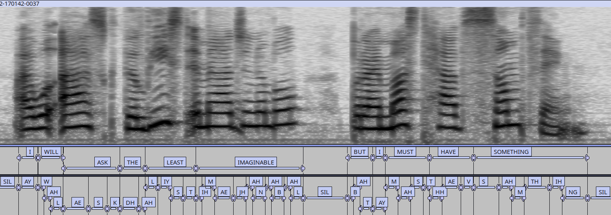

# Mini LibriSpeech

This recipe demonstrates how to use self-supervised speech representations as acoustic features in Kaldi. Pretrained HuBERT models are evaluated with both hybrid chain and traditional GMM-HMM systems on Mini LibriSpeech.

## Results (WER % on dev-clean)

| Features | Acoustic Model | LM | WER (%) |
|-----------|---------------|----|---------|
| **HuBERT Large (LL60K, layer 14)** | **Chain TDNN** | **tglarge** | **4.15** |
| HuBERT Base (LS960) | Chain TDNN | tglarge | 4.28 |
| HuBERT Large (LL60K, layer 12) | Chain TDNN | tglarge | 4.70 |
| HuBERT Large (LL60K, layer 14) | E2E TDNN-F | tglarge | 4.90 |
| HuBERT Large (LL60K, layer 14) | Tri3b | tglarge | 10.92 |
| HuBERT Large (LL60K, layer 14) | Mono | tglarge | 27.31 |
| Kaldi MFCC/filterbank baseline | CNN-TDNN | tglarge | 6.79 |

## Key Findings

- SSL features significantly outperform conventional MFCC/filterbank features.
- The best result is **4.15% WER** using `facebook/hubert-large-ll60k` layer 14 with a chain TDNN model.
- This corresponds to a **39% relative WER reduction** compared to the Kaldi baseline (6.79% → 4.15%).
- Intermediate HuBERT layers perform best for ASR; layer 14 outperformed layer 12 in our experiments.
- Traditional GMM-HMM systems (Tri3b and Mono) also benefit substantially from SSL representations, demonstrating that HuBERT embeddings contain strong phonetic information.
- See RESULTS for a complete set of experimental results and analysis

## Tested SSL Models

- `facebook/hubert-base-ls960`
- `facebook/hubert-large-ll60k`

## Alignment Accuracy

[play audio](https://rawcdn.githack.com/ialmajai/ssl-kaldi/02d212f330085da3ac7bce5d014dd1027dc6ae5a/egs/mini_librispeech/s5/docs/index.html)